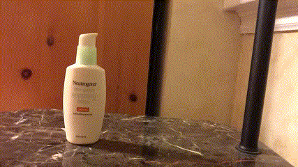
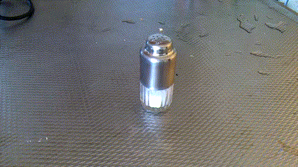
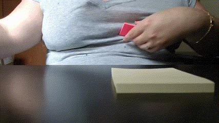
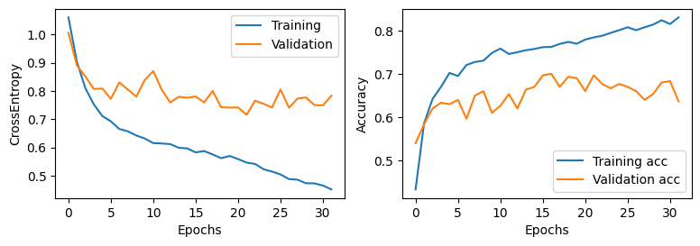
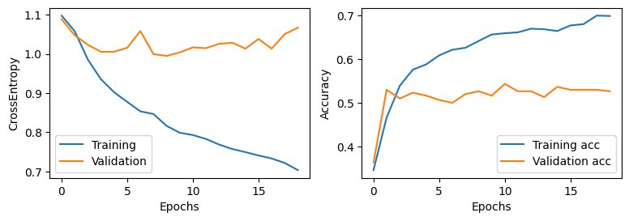
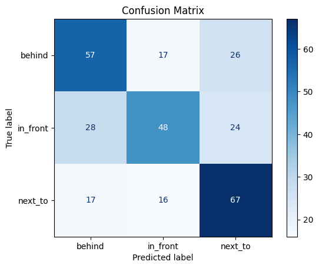
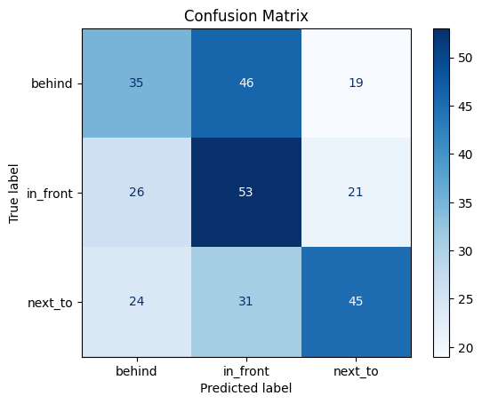

# Video Classification with CNN+RNN and CNN+MLP: A Comparative Study

## Introduction
Video classification is challenging due to temporal dependencies between frames. Unlike image classification, video classification requires capturing sequential patterns. This project compares two approaches:

- **CNN+RNN**: Uses a pre-trained MobileNet CNN for feature extraction, followed by an RNN (GRU) model.
- **CNN+MLP**: Uses the same CNN but applies a Multi-Layer Perceptron (MLP), treating frames independently.

## Dataset
The dataset is **Something Something v2**, consisting of short video clips across various action categories. Each video is represented by 16 frames sampled at equal intervals.

### Sample Videos
Below are examples from three categories:
1. Putting something behind something
   
3. Putting something in front of something
   
5. Putting something next to something
   

## Feature Extraction with CNN
MobileNet CNN extracts features from each video frame:
- **Input**: Single RGB frame (resized to 224x224).
- **Output**: Feature vector of size 320 per frame.

These features are fed into the RNN (GRU) or MLP for classification.

## Training Setup
The dataset was split as follows:
- **Training set**: 800 videos per category (2400 total).
- **Validation set**: 100 videos per category (300 total).
- **Test set**: 100 videos per category (300 total).

### Model Architecture and Training Details
| Category                | CNN+RNN                          | CNN+MLP                          |
|-------------------------|----------------------------------|----------------------------------|
| **Sequence Model**      | 2-layer Bidirectional GRU        | Fully connected MLP              |
| **Input Size**          | 320 (CNN feature output)         | 320 (CNN feature output)         |
| **Hidden Size**         | 16                               | 16 (first layer), 8 (second layer) |
| **Number of Layers**    | 2                                | 3 (Fully connected layers)       |
| **Activation Function** | GRU internal activations         | ReLU                             |
| **Dropout**             | 0.35                             | 0.3 (after first and second layers) |
| **Bidirectional**       | Yes                              | No                               |
| **Fully Connected Layer** | Linear(hidden_size * 2 → num_classes) | Linear(320 → 16 → 8 → num_classes) |
| **Loss Function**       | CrossEntropyLoss                 | CrossEntropyLoss                 |
| **Optimizer**           | Adam                             | Adam                             |
| **Learning Rate**       | 0.0025                           | 0.001                            |
| **Batch Size**          | 32                               | 32                               |
| **Early Stopping**      | Yes (based on validation loss)   | Yes (based on validation loss)   |

## Results

### Performance Comparison
- **CNN+RNN**: Achieved 57.33% test accuracy.
- **CNN+MLP**: Achieved 44.33% test accuracy.

### Confusion Matrices
- **CNN+RNN Model**:
  

- **CNN+MLP Model**:
  

### Example Predictions
#### CNN+RNN Predictions
- Video 1: Predicted = "behind", Actual = "behind"
- Video 2: Predicted = "next_to", Actual = "in_front"
- Video 3: Predicted = "next_to", Actual = "next_to"

*View videos*: [Behind](assets/behind.gif), [In Front](assets/in_front.gif), [Next to](assets/next_to.gif)

#### CNN+MLP Predictions
- Video 1: Predicted = "next_to", Actual = "behind"
- Video 2: Predicted = "next_to", Actual = "in_front"
- Video 3: Predicted = "in_front", Actual = "next_to"

*View videos*: [Behind](assets/behind.gif), [In Front](assets/in_front.gif), [Next to](assets/next_to.gif)

## Conclusion
Key takeaways:
- **Sequences matter**: CNN+RNN outperformed CNN+MLP due to its ability to recognize patterns across frames.
- **MLP limitations**: MLP's frame-independent approach failed to capture temporal relationships, resulting in lower accuracy.
- **Future work**: Exploring transformer-based models could improve performance on sequential data.

## Code
The implementation is available in the repository:
- [CNN+RNN Notebook](cnn_rnn.ipynb)
